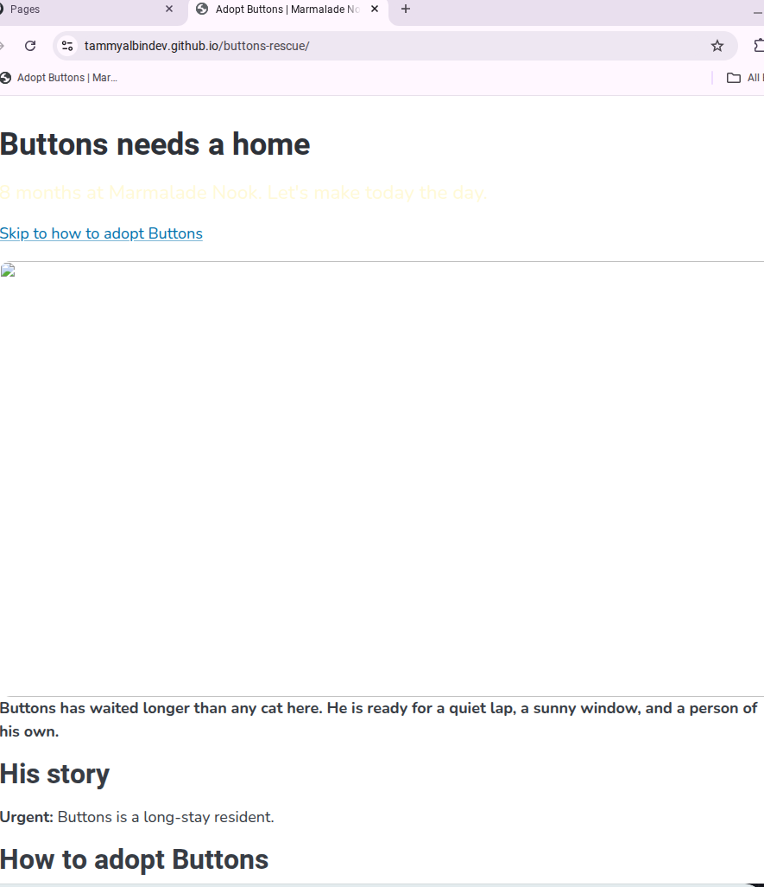
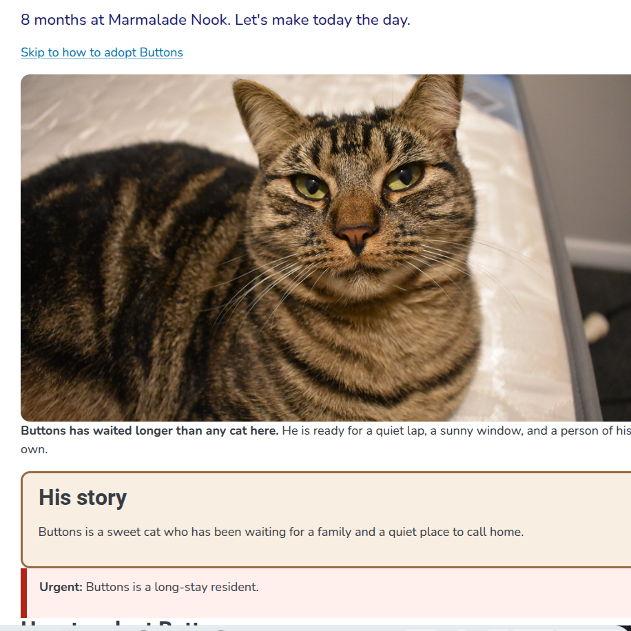

# Buttons' Rescue

The adoption page for Buttons, a long-stay cat at Marmalade Nook.

I inherited this page broken, documented the problems as issues, and repaired it one fix and one commit at a time.

## Before and after

## What I fixed

- Fixed the missing Buttons photo by correcting the image filename.
- Fixed the bold text so only the intended sentence is bold.
- Fixed the skip link so it points to the correct section.
- Repaired the page styling and layout issues.
- Added Buttons' story content.
- Cleaned up the final page presentation.

## Credits

Photo: "Cat" by Burnt Pineapple Productions, CC0 1.0.

Live page:
https://tammyalbindev.github.io/buttons-rescue/

